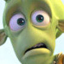

# Template Matching Python OpenCV.

Template Matching es un método para buscar y encontrar la ubicación de una imagén en una imagen más grande. OpenCV viene con una función cv2.matchTemplate() para este propósito. Simplemente desliza la imagén de la plantilla sobre la imagén de entrada (como en la convolución 2D) y compara la plantilla y el parche de la imagén de entrada debajo de la imagén de la plantilla. Varios métodos de comparación se implementan en OpenCV. Devuelve una imagén en escala de grises, donde cada píxel indica cuánto concuerda la vecindad de ese píxel con la plantilla.

Para esto hacen falta los siguientes componentes:

+ Foto base.
+ Objeto a buscar.
+ Tolerancia.
+ Rectángulo.


#### Foto base

La "foto base" es la imagén en la que se va a buscar el objeto que se desea encontrar, para nuestro ejemplo vamos a utilizar la portada de la pelicula Planet 51.

#### Objeto a buscar

El objeto a buscar es aquel componente de la foto base que deseamos encontrar, se puede dar el caso que el resultado de la busqueda devuelva valores inesperados, esto se debe a la tolerancia que se le asigne a la busqueda.

#### Tolerancia

La tolerancia es la medida a partir de la cual nuestro script determinara si la imagen contiene el objeto que deseamos buscar, cabe recalcar que no siempre se debe utilizar la misma tolerancia, en el caso de la portada de la pelicula no hace falta utilizar un alto grado de tolerancia, ya que se puede encontrar con facilidad al personaje que desea buscar. La tolerancia se declara en una variable tipo Float.

#### Rectángulo

Por ultimo se encuentra el rectangulo, que es el componente con el cual sera mostrado el objeto, no es obligatorio el uso del rectangulo, tambien se pueden utilizar circulos o poligonos entre otros.

Esta es la sintaxis para dibujar un rectangulo:

#### cv2.rectangle(img,(100,100),(400,400),(0,0,255),10)
#
Link Draws: https://docs.opencv.org/3.1.0/dc/da5/tutorial_py_drawing_functions.html

### Ejemplo único resultado.

En el siguiente ejemplo vamos a utilizar como objeto de búsqueda la cara de uno de los personajes que aparecen en la imagen.


###### Imagen: https://i.blogs.es/d0a0dd/planet_51/450_1000.jpg



```
import cv2
import numpy as np

#Esta variable toma como valor la foto de portada de la pelicula.
img_rgb = cv2.imread('planet_51.jpg')

img_gray = cv2.cvtColor(img_rgb, cv2.COLOR_BGR2GRAY)

#La variable template toma el valor de la imagen que deseamos buscar.

template = cv2.imread('cara_planet_51.jpg',0)
w, h = template.shape[::-1]

#res es el resultado de la funcion matchTempalte entre img_rgb y template 

res = cv2.matchTemplate(img_gray,template,cv2.TM_CCOEFF_NORMED)

#Threshold es la tolerancia, 1 es el maximo y 0.1 el minimo.

threshold = 0.3

loc = np.where( res >= threshold)

#Por cada vez que se encuentran las 2 imagenes se dibuja el rectangulo.

for pt in zip(*loc[::-1]):
    cv2.rectangle(img_rgb, pt, (pt[0] + w, pt[1] + h), (0,0,0), 2)

#imsshow es para mostrar el resultado

cv2.imshow('Detected',img_rgb)

#imwrite se utiliza para guardar el resultado en un archivo llamada 'resultado.png'

cv2.imwrite('resultado.png',img_rgb)
cv2.waitKey(0)
cv2.destroyAllWindows()
```
### Ejemplo varios resultados.

En este ejemplo a diferencia del primero la imagen en la que vamos a realizar la búsqueda va a devolver varios resultados, la imagen elegida muestra a mas de 50 personajes de los Simpsons.

###### Imagen: https://aws.revistavanityfair.es/prod/designs/v1/assets/785x589/836.jpg
#
#### Cara de Maggie: 

```
import cv2
import numpy as np

img_rgb = cv2.imread('todos.jpg')
img_gray = cv2.cvtColor(img_rgb, cv2.COLOR_BGR2GRAY)

#En este caso en vez de buscar la cara del alien, buscamos la cara de Maggie.

template = cv2.imread('maggie.png',0)
w, h = template.shape[::-1]

res = cv2.matchTemplate(img_gray,template,cv2.TM_CCOEFF_NORMED)

#Para esta busqueda es necesario bajar la tolerancia para que encuentre a Maggie pero a su vez trae personajes que no son los esperados.

threshold = 0.3
loc = np.where( res >= threshold)

for pt in zip(*loc[::-1]):
    cv2.rectangle(img_rgb, pt, (pt[0] + w, pt[1] + h), (0,0,0), 2)

cv2.imshow('Detected',img_rgb)
cv2.imwrite('simpsons_resultado.png',img_rgb)
cv2.waitKey(0)
cv2.destroyAllWindows()
```

Como conclusión podemos afirmar que la funcion **matchTemplate** de OpenCV es 100% eficaz en los casos donde no hay un alto nivel de complejidad al momento de realizar la busqueda, como en el primer caso. Por otro lado cuando comparamos el objeto con un fondo que contiene valores "parecidos" al que se desea encontrar devuelve valores que no son los esperados.
